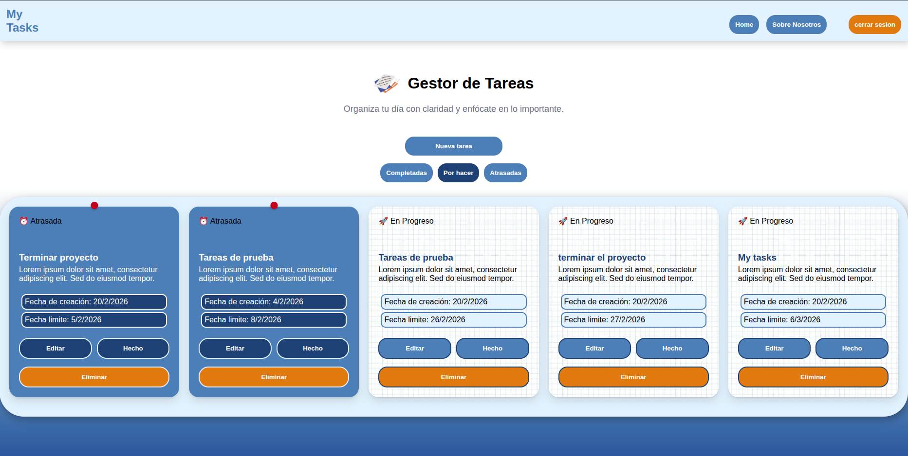

# My Tasks

## Descripcion:

My tasks es una pagina web de organizacion de tareas, el usuario inicia sesion y puede acceder a las tareas completadas, pendientes, y en proceso. Ideal para utilizar como agenda para estudiantes, en cada tarea se puede poner una fecha limite, la descripcion, titulo y estado de la tarea. Tambien esta la posiblidad de filtrar estas dependiendo de su estado. 


## Tecnologias utilizadas: 

React: Biblioteca de JavaScript utilizada para crear la interfaz de usuario utilizando JSX para una interaccion mas dinamica con la pagina.

React Router: Librería para gestionar la navegacion entre las ditintas vistas.

Firebase Authentication: Para la autenticacion de usuario, permitiendo manejar los datos de forma segura sin la necesidad de implementar un backend propio.

Firestore: Base de datos para almacenar las tareas de cada usuario.

AuthContext: Para el manejo del estado global de la autenticación, evitando el prop drilling.

## Instalacion y ejecucion del proyecto

clonar el repositorio:

```git clone git@github.com:florenciaarnez/gestor-tareas-react.git ```

instalar dependencias: 

```npm install```

configuracion de entorno: 

Crea un archivo .env fuera de src y añade tus credenciales de Firebase. 

Nota: Al usar Vite, las variables deben empezar con VITE_  tal como aprecen en .env.production

correr entorno de desarollo:

```npm run dev```

## Estructura del proyecto:
se  opto por un diseño modular para mejor organizacion y escalabilidad en el futuro.

``` src/``
contiene todos los componentes de mi pagina 

``` components/``` 
contiene los componentes para la reutilizacion de codigo en todas las paginas, protectedRoute.jsx para la proteccion de rutas /home 

``` config/```
contiene toda la configuracion con Firebase, con la utilizacion de variables de entorno

``` context/```
Manejo de estado global de autenticacion 

``` router/```
Manejo de rutas y proteccion de ellas

``` services/```
configuracion de consultas a firebase y consumo de api

``` styles/```
Estilos de cada vista y componente

``` views/```
contiene lñas distintas vistas de mi aplicacion

## Consideraciones Generales:

### Manejo de fechas en firebase

Se centralizo la transformacion de timestamp con to date() en las querys para mantener mas limpio el front y solo trabajar con date js

### Optimizacion de consultas:

Para el filtrado de tareas se opto por realizarlas en el front mediante estados para asi evitar peticiones inecesarias